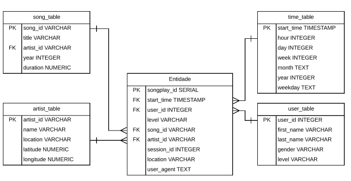

# __Data Modeling with Postgress__

## Introduction 

A music streaming app called Sparkify generates a lot of data from users and songs. The data analytics team wants to work in these data and asked a data engineer to prepare all data in.JSON format about users and songs. Both of them are in directories and subdirectories. It was passed to data engineering to create an ETL pipeline using Python to get all data and use data modeling techniques as **Star Schema** to organize in an easier way to the analytics team.

## How to use

1. test.ipynb displays the first few rows of each table to let check the database
2. create_table.py drops and creates the tables. This file is run to reset the tables before each time the ETL scripts will be run
3. etl.ipynb reads and processes a single file from song_data and log_data and loads the data into the tables.
4. etl.py reads and processes files from song_data and log_data and loads them into the tables. This is based on etl.ipynb
5. sql_queries.py contains all SQL queries and is imported into the last three files above

## About data
Both dataset used in this project can be founded in data folder.
    
### Song Dataset
The first dataset is a subset of real data from the [Million Song Dataset](http://millionsongdataset.com/). Each file is in JSON format and contains metadata about a song and the artist of that song. The files are partitioned by the first three letters of each song's track ID. For example, here are file paths to two files in this dataset.

>song_data/A/B/C/TRABCEI128F424C983.json

>song_data/A/A/B/TRAABJL12903CDCF1A.json
    
And below is an example of what a single song file, TRAABJL12903CDCF1A.json, looks like.

`{"num_songs": 1, "artist_id": "ARJIE2Y1187B994AB7", "artist_latitude": null, "artist_longitude": null, "artist_location": "", "artist_name": "Line Renaud", "song_id": "SOUPIRU12A6D4FA1E1", "title": "Der Kleine Dompfaff", "duration": 152.92036, "year": 0}`

### Log Dataset
The second dataset consists of log files in JSON format generated by this [event simulator](https://github.com/Interana/eventsim) based on the songs in the dataset above. These simulate activity logs from a music streaming app based on specified configurations.

The log files in the dataset you'll be working with are partitioned by year and month. For example, here are file paths to two files in this dataset.

>log_data/2018/11/2018-11-12-events.json

>log_data/2018/11/2018-11-13-events.json

And below is an example of what the data in a log file, 2018-11-12-events.json, looks like.

If you would like to look at the JSON data within log_data files, you will need to create a pandas dataframe to read the data. Remember to first import JSON and pandas libraries.

>df = pd.read_json(filepath, lines=True)

For example,
>df = pd.read_json('data/log_data/2018/11/2018-11-01-events.json', lines=True)

would read the data file 2018-11-01-events.json.

## Schema

    
