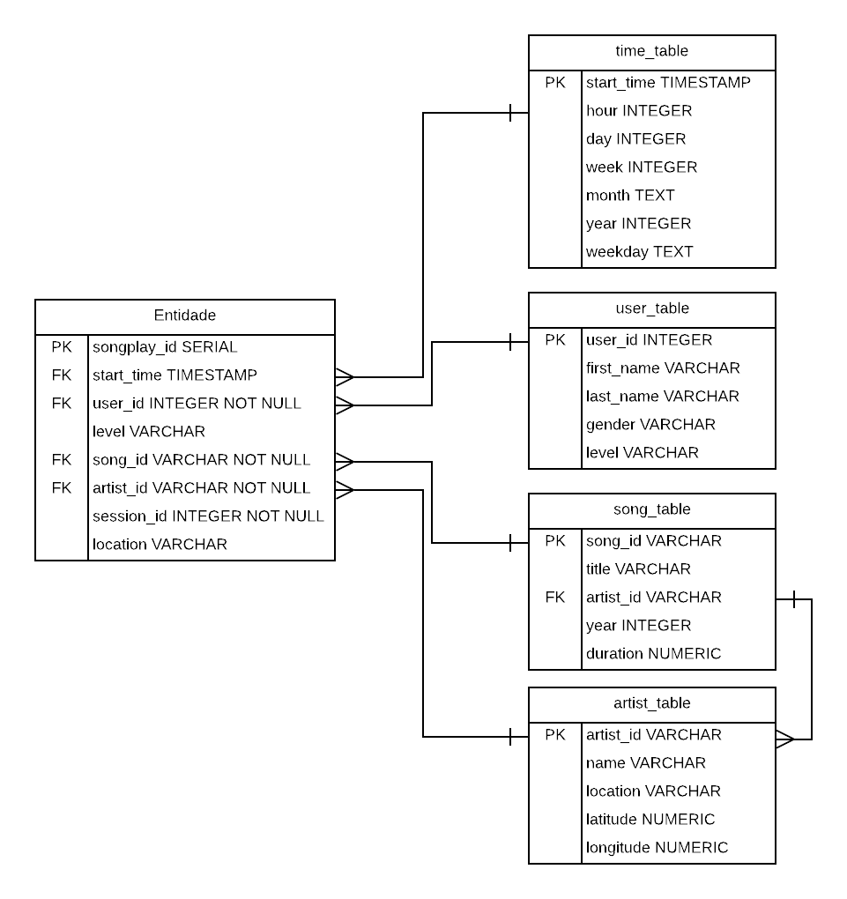

# __Data Modeling with Postgress__

## Introduction 

       A music streaming app called Sparkify generates a lot of data from users and songs. The data analytics team wants to work in these data and asked to a data engineer to prepare those archieve .JSON about users and .JSON metadata about songs. Both of them are in directories and subdirectories. It was passed to data engineering to create a ETL pipeline using Python to get all data and use data modeling techniques as Star Schema to organize in a easier way to analytics team.

## How to use

1. The create_tables.py need to be run first to do the conection with database and create all tables.
2. The etl.py can be run after step 1, it will extract all data from .JSON format archieves and put it tables
3. The sql_queries.py have all sql commands to drop, create, insert and queries used in etl.py and create_tables.py

## About data
    Both dataset used in this project can be founded in data folder.
    
### Song Dataset
    The dataset is a piece of real data from the [Million Song Dataset](http://millionsongdataset.com). Each file is in JSON format and contains metadata about a song and the artist of that song.
    
### Log Dataset
    The data was generated by [the event simulator](https://github.com/Interana/eventsim) based on the songs in the dataset above.These simulate activity logs fom a music streaming app based on specified configurations.

## Database Schema

    
